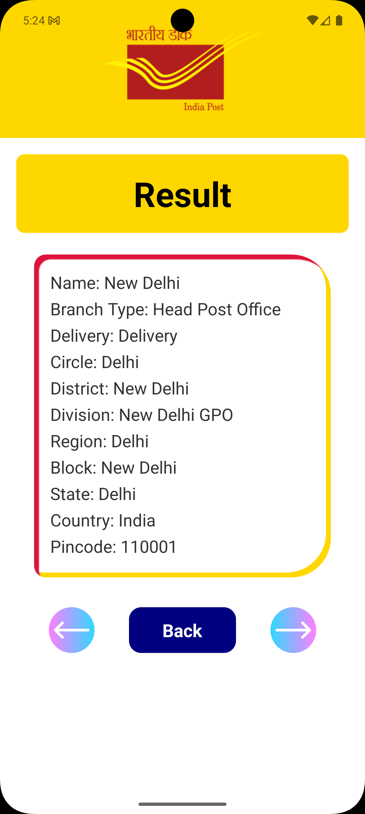
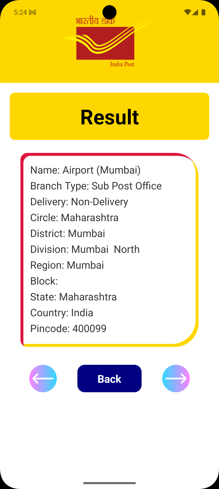

# 📮 PinCode Finder

A sleek and simple React Native application that allows users to search Indian post offices either by **Pincode** or **Post Office Name** using the [India Postal API](https://api.postalpincode.in/). It features a smooth tab interface and paginated results.

---

## ✨ Features

- 🔍 Search post office information by **Pincode** or **Post Office Name**
- 📦 View detailed info: Branch Type, District, Division, State, and more
- 🔄 Swipe-style tab switch with animated transitions
- 📱 Clean and mobile-friendly UI
- 🚀 Fast response and simple navigation

---

## 📷 Screenshots

<!-- *(Add screenshots of the app UI here if available)* -->




---

## 🚀 Getting Started

### Prerequisites

- Node.js >= 14
- React Native CLI
- Android Studio / Xcode (depending on platform)
- A real or virtual mobile device

### Installation

```bash
git clone https://github.com/KeshavAbhishek/pincode.git
cd pincode
npm install
